# Dijital Lastik Servisi Yönetim Sistemi

Lastik satış ve servis işletmesi için masaüstü + mobil yönetim sistemi.

## Modüller

- Ürün kataloğu & stok yönetimi (QR/barkod ile)
- Tedarikçi & borç takibi
- Alım yönetimi
- Müşteri & satış
- Tamir / servis hizmeti
- Gider takibi
- Günlük / haftalık / aylık raporlar

## Ekran Görüntüleri

### Masaüstü

**Dashboard** — günlük / aylık ciro, kâr, satış adedi ve genel durum özeti

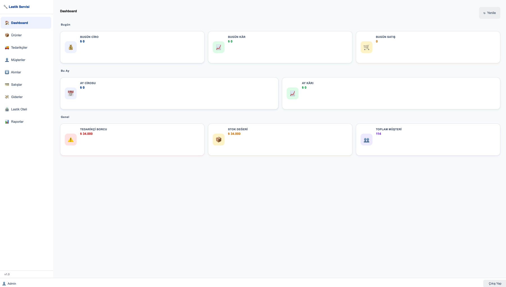

**Ürünler** — barkod/QR, ebat, marka, model, mevsim, satış-maliyet fiyatı ve stok takibi

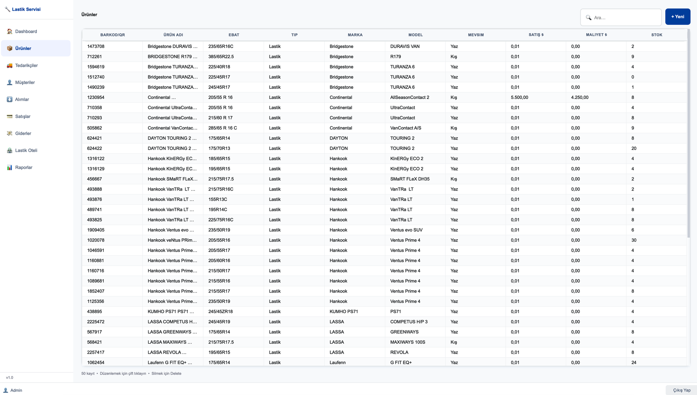

**Tedarikçiler** — tedarikçi listesi ve güncel borç durumu, ödeme kaydı

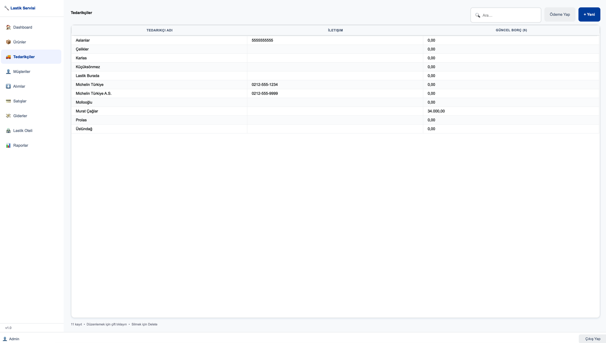

**Müşteriler** — ad soyad, telefon, araç markası, plaka ve notlar

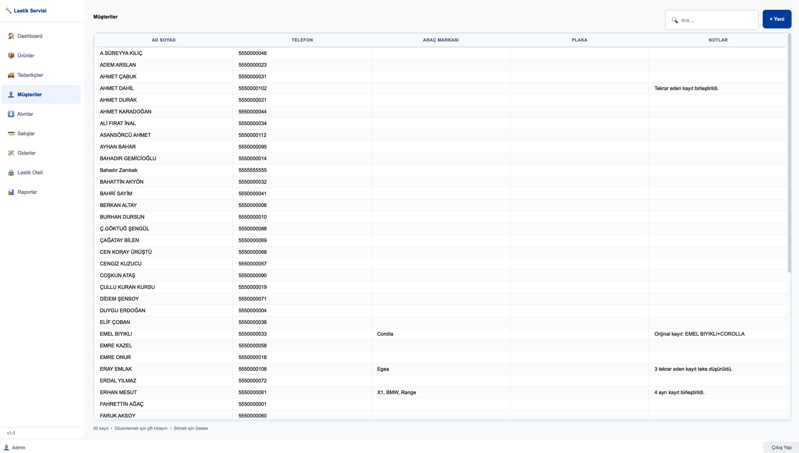

**Alımlar** — tedarikçi bazlı alım kayıtları ve tutarları

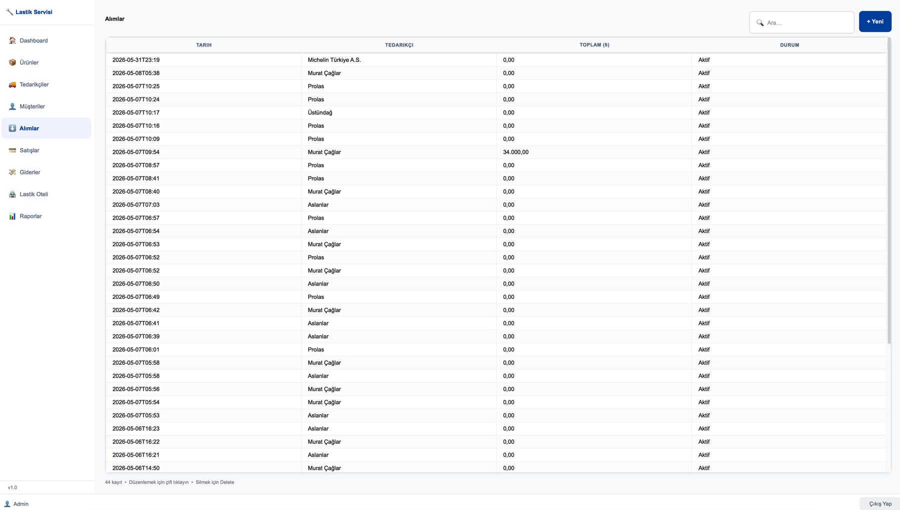

**Lastik Oteli** — raf konumu, müşteri, lastik bilgisi, sezon ve teslim durumu

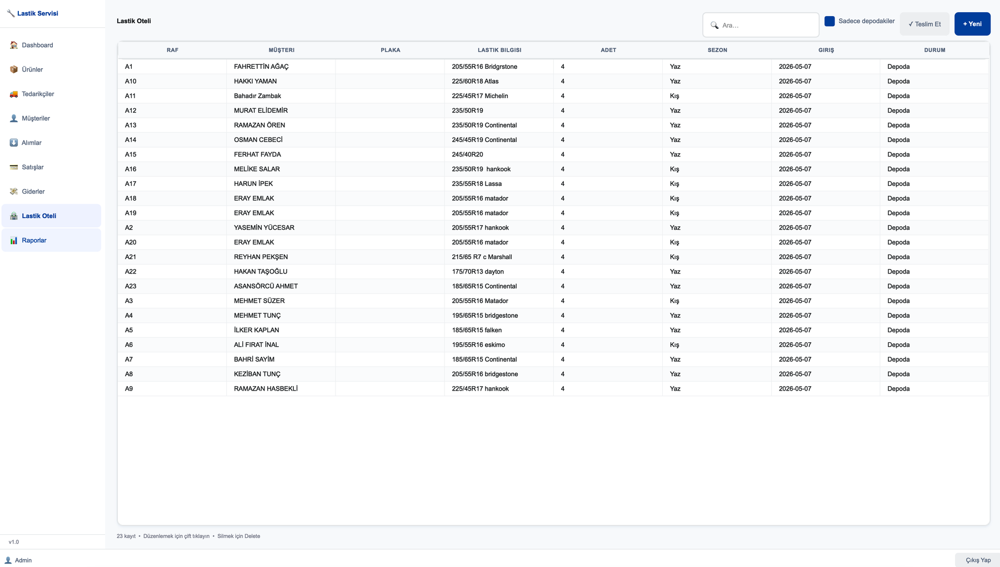

**Raporlar** — tarih aralığına göre ciro/kâr/gider özeti, günlük kırılım ve en çok satanlar; PDF ve yazdırma çıktısı

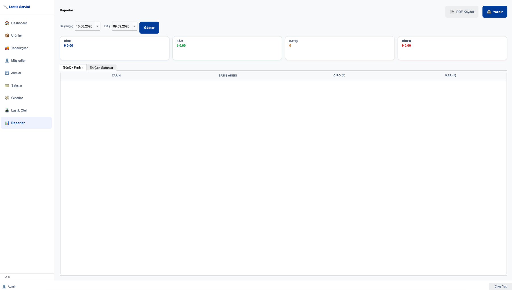

### Mobil

| Dashboard | Ürünler | Müşteriler | Lastik Oteli |
| --- | --- | --- | --- |
| 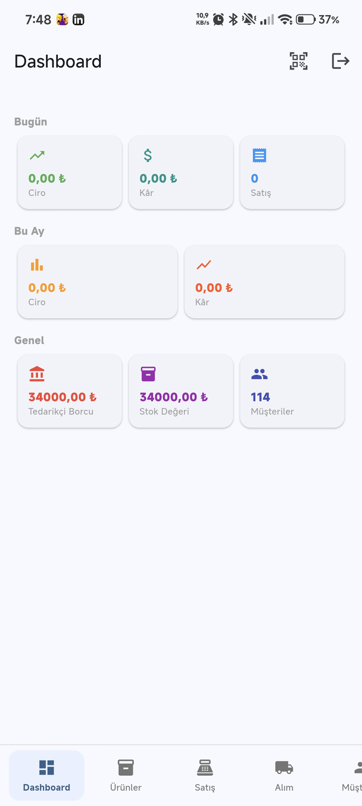 | 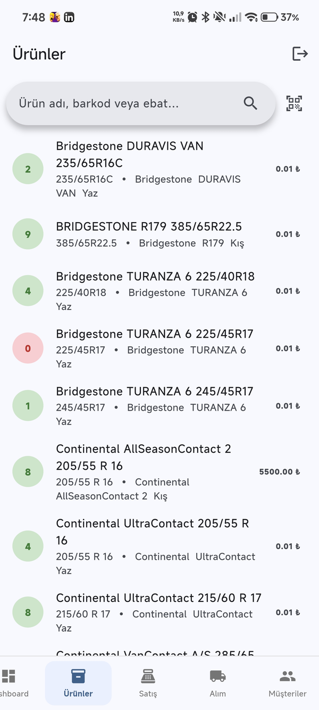 | 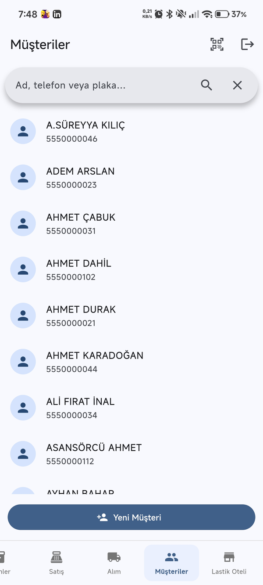 | 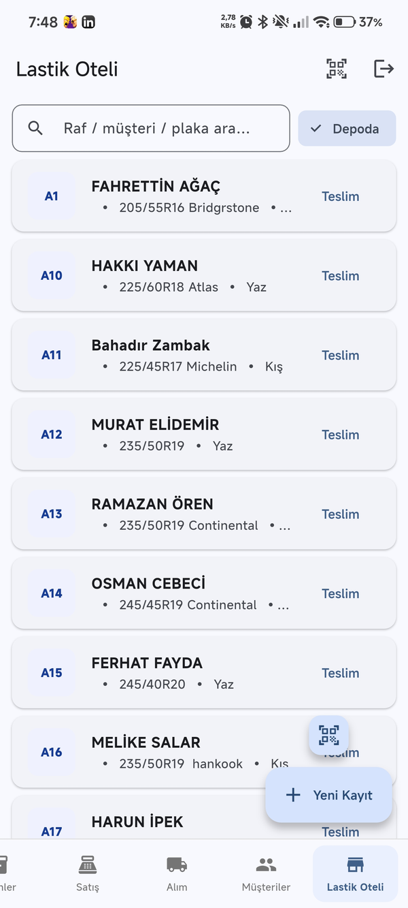 |

## Mimari

Bkz. [docs/architecture.md](docs/architecture.md)

## Kurulum

### VPS (ilk kurulum)
```bash
bash deploy/scripts/setup_vps.sh
```

### Güncelleme
```bash
bash deploy/scripts/deploy.sh
```

### Yerel Geliştirme (Backend)
```bash
cd backend
python -m venv .venv
source .venv/bin/activate      # Windows: .venv\Scripts\activate
pip install -r requirements.txt
cp .env.example .env            # .env'i düzenle
uvicorn app.main:app --reload
```

API dökümantasyonu: `http://localhost:8000/docs`
